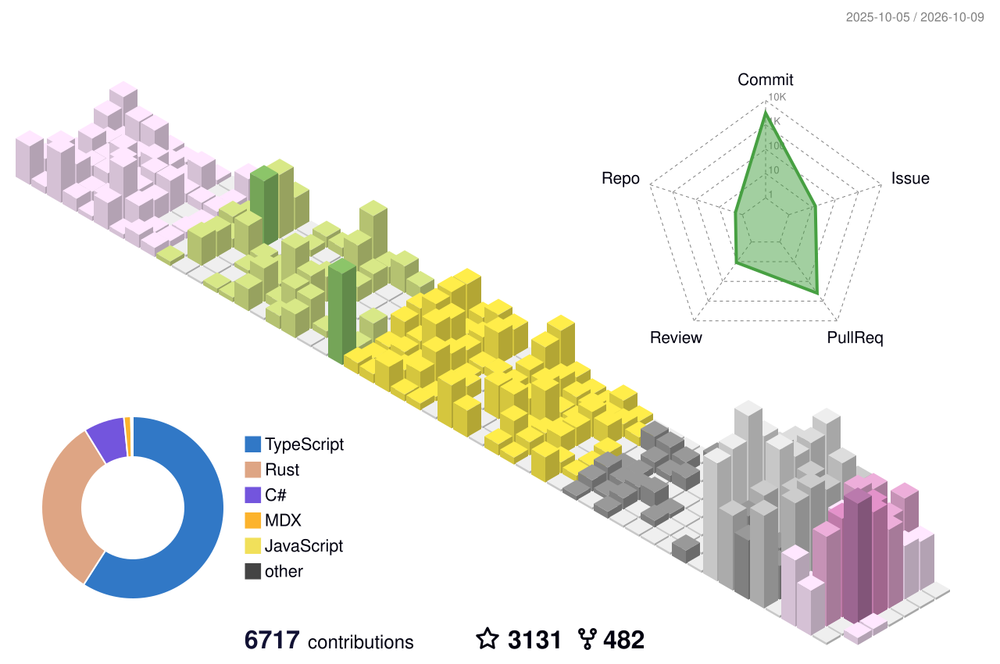

  <picture>
    <source media="(prefers-color-scheme: dark)" srcset="https://skillicons.dev/icons?i=cs,rust,ts,unity&amp;theme=dark">
    
  </picture>

    

  <picture>
    <source media="(prefers-color-scheme: dark)" srcset="./profile-3d-contrib/profile-night-rainbow.svg">
    <source media="(prefers-reduced-motion: reduce)" srcset="./profile-3d-contrib/profile-south-season.svg">
    
  </picture>

